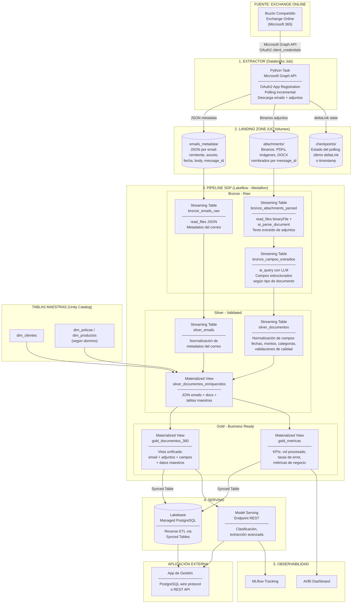
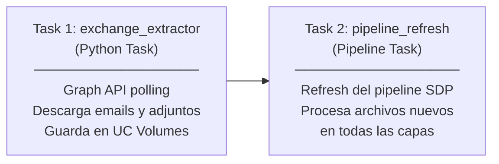

# Arquitectura de Referencia: Ingesta de Correos Exchange Online con OCR en Databricks

> Documento de arquitectura end-to-end para ingerir correos electrónicos desde un
> buzón compartido de Exchange Online (Microsoft 365), extraer adjuntos (PDFs, imágenes,
> DOCX), aplicar OCR/parsing con IA y llevar los datos estructurados a una arquitectura
> Lakehouse en Databricks.
>
> **Stack**: 100% Databricks — Unity Catalog, ai_parse_document, ai_query,
> Lakeflow SDP, Lakebase, Databricks Workflows, AI/BI Dashboards.

---

## Tabla de Contenidos

1. [Diagrama de Arquitectura de Alto Nivel](#1-diagrama-de-arquitectura-de-alto-nivel)
2. [Descripción de Cada Capa y Componente](#2-descripción-de-cada-capa-y-componente)
3. [Flujo de Datos End-to-End](#3-flujo-de-datos-end-to-end)
4. [Componentes Databricks Utilizados](#4-componentes-databricks-utilizados)
5. [Estructura del Proyecto](#5-estructura-del-proyecto)
6. [Prerequisitos y Configuración](#6-prerequisitos-y-configuración)
7. [Despliegue](#7-despliegue)

---

## 1. Diagrama de Arquitectura de Alto Nivel



---

## 2. Descripción de Cada Capa y Componente

### Capa 1: Extractor de Exchange Online (Databricks Job)

| Aspecto | Detalle |
|---------|---------|
| **Componente** | Python Task en Databricks Job (serverless) |
| **Autenticación** | OAuth2 `client_credentials` flow con Azure AD App Registration |
| **Permisos Graph API** | `Mail.Read` (application permission, sin delegación de usuario) |
| **Secretos** | Databricks Secrets — scope `exchange-online` con `client-id`, `client-secret`, `tenant-id`, `mailbox-address` |
| **Polling** | Incremental vía `deltaLink` de Microsoft Graph (solo mensajes nuevos) |
| **Frecuencia** | Cada 10-15 minutos vía cron en Databricks Workflows |
| **Idempotencia** | deltaLink garantiza procesamiento exactamente-una-vez; fallback por `receivedDateTime` |

El extractor:
1. Se autentica con MSAL (Microsoft Authentication Library)
2. Consulta el endpoint `/users/{mailbox}/messages/delta` para obtener solo correos nuevos
3. Por cada correo: guarda metadatos como JSON en el Volume `emails_metadata/`
4. Si tiene adjuntos: descarga cada `fileAttachment` como binario al Volume `attachments/`
5. Persiste el `deltaLink` retornado por Graph API para el próximo polling

Ver implementación: [`src/extractor/exchange_extractor.py`](src/extractor/exchange_extractor.py)

### Capa 2: Landing Zone (UC Volumes)

```
/Volumes/{catalog}/{schema}/landing/
├── emails_metadata/
│   ├── AAMk...abc.json            # Un JSON por email
│   ├── AAMk...def.json
│   └── ...
├── attachments/
│   ├── AAMk...abc__factura.pdf    # Patrón: {message_id}__{filename}
│   ├── AAMk...abc__foto.jpg
│   ├── AAMk...def__reporte.pdf
│   └── ...
└── checkpoints/
    └── delta_link.json             # Estado del último polling
```

- Los archivos se nombran con el `message_id` como prefijo para mantener la relación email-adjunto
- El separador `__` (doble guion bajo) permite extraer ambos componentes vía regex en el pipeline
- Unity Catalog provee gobernanza completa: permisos por Volume, linaje, auditoría

### Capa 3: Pipeline de Datos (Lakeflow SDP — Medallion)

El pipeline se implementa con **Lakeflow Spark Declarative Pipelines (SDP)** usando compute
serverless y arquitectura medallion (bronze / silver / gold).

#### Bronze: Extracción Raw

**`bronze_emails_raw`** (Streaming Table)
- Lee los JSONs de metadatos de correo con `read_files()` en modo streaming
- Preserva todos los campos originales + `_ingested_at` y `_source_file`

**`bronze_attachments_parsed`** (Streaming Table)
- Lee binarios de adjuntos con `read_files(format => 'binaryFile')`
- Aplica `ai_parse_document()` para OCR/parsing
- Extrae `message_id` y nombre original del archivo desde el nombre del archivo
- Concatena el texto de todos los elementos del documento parseado
- Registra errores de parsing en columna `parse_error`

**`bronze_campos_extraidos`** (Streaming Table)
- Aplica `ai_query()` con LLM para extraer campos estructurados del texto parseado
- Retorna un STRUCT tipado con campos como: `tipo_documento`, `numero_documento`,
  `fecha_emision`, `fecha_vencimiento`, `monto_total`, `moneda`, `numero_poliza`, etc.
- Filtra documentos sin contenido útil (`length(full_text) > 50`) y con errores de parsing

#### Silver: Normalización y Enriquecimiento

**`silver_emails`** (Streaming Table)
- Normaliza metadatos del correo: emails en minúsculas, extracción de dominio del remitente
- Cast de tipos (timestamps, dates)

**`silver_documentos`** (Streaming Table)
- Normaliza campos extraídos: fechas a formato ISO, montos a DECIMAL, moneda estandarizada
- Aplica validaciones de calidad (`_quality_flag`): tipo detectado, monto válido
- Registros inválidos se marcan pero no se eliminan (para auditoría)

**`silver_documentos_enriquecidos`** (Materialized View)
- JOIN con `silver_emails` por `message_id` (vincula adjunto con su correo)
- JOIN con `dim_clientes` por identificación del remitente
- JOIN con `dim_polizas` por número de póliza (si aplica al dominio)

#### Gold: Vistas de Negocio

**`gold_documentos_360`** (Materialized View)
- Vista unificada: email + adjunto + campos extraídos + datos maestros
- Campos calculados: `dias_vencido`, `estado_vencimiento` (VENCIDO/POR_VENCER/VIGENTE)
- Solo registros con `_quality_flag = 'valid'`

**`gold_metricas`** (Materialized View)
- KPIs agregados por mes, tipo de documento, dominio del remitente, segmento de cliente
- Métricas: total documentos, monto total, docs vencidos, remitentes únicos

### Capa 4: Serving de Baja Latencia

| Aspecto | Detalle |
|---------|---------|
| **Componente** | Lakebase Provisioned (Managed PostgreSQL) |
| **Latencia** | < 10ms para point lookups OLTP |
| **Sincronización** | Reverse ETL vía Synced Tables desde tablas Gold |
| **Tablas sincronizadas** | `gold_documentos_360`, `gold_metricas` |
| **Modo de sync** | `CONTINUOUS` (segundos de latencia) o `TRIGGERED` (bajo demanda) |
| **Autenticación** | OAuth token (1h expiry, refresh automático) |
| **Protocolo** | PostgreSQL wire protocol, `sslmode=require` |

### Capa 5: Observabilidad

- **AI/BI Dashboard**: Documentos procesados por hora/día, tasa de error de parsing,
  tasa de extracción exitosa, métricas de negocio (montos, vencimientos, tipos)
- **MLflow Tracking**: Linaje de modelos si se usa Model Serving para clasificación avanzada

---

## 3. Flujo de Datos End-to-End

```mermaid
flowchart LR
    subgraph step1 ["1. Polling"]
        A["Graph API\npolling incremental\nvía deltaLink"]
    end
    subgraph step2 ["2. Landing"]
        B["UC Volumes\nJSON metadata +\nbinarios adjuntos"]
    end
    subgraph step3 ["3. Parsing"]
        C["ai_parse_document\nOCR sobre PDFs\ne imágenes"]
    end
    subgraph step4 ["4. Extracción"]
        D["ai_query + LLM\nCampos estructurados:\ntipo, monto, fecha,\npóliza, remitente"]
    end
    subgraph step5 ["5. Normalización"]
        E["Fechas estándar\nMontos DECIMAL\nCategorías unificadas\nValidación calidad"]
    end
    subgraph step6 ["6. Enriquecimiento"]
        F["JOIN dim_clientes\nJOIN dim_polizas\nJOIN silver_emails"]
    end
    subgraph step7 ["7. Gold"]
        G["Vista 360 unificada\nMétricas agregadas"]
    end
    subgraph step8 ["8. Serving"]
        H["Lakebase PostgreSQL\nsub-segundo"]
    end

    A --> B --> C --> D --> E --> F --> G --> H
```



### Orquestación

El Job de Databricks Workflows tiene dos tasks encadenadas:



- **Schedule**: Cron cada 10-15 minutos (ajustable según volumen)
- **Retry**: Task 1 con retry x3 (Graph API puede tener throttling), Task 2 sin retry (SDP es idempotente)
- **Alertas**: Notificación por email/Slack en caso de fallo

---

## 4. Componentes Databricks Utilizados

| Componente | Servicio Databricks | Propósito | Capa |
|------------|---------------------|-----------|------|
| Almacén de archivos | **Unity Catalog Volumes** | Repositorio gobernado de emails y adjuntos | Landing |
| Credenciales | **Databricks Secrets** | Almacenamiento seguro de client_id, client_secret, tenant_id | Extractor |
| Extractor | **Databricks Job** (Python Task) | Polling a Graph API y descarga de emails/adjuntos | Extractor |
| Parsing OCR | **`ai_parse_document()`** (DBSQL AI Function) | Extracción de texto/tablas desde PDFs e imágenes | Bronze |
| Extracción de campos | **`ai_query()`** con LLM (DBSQL AI Function) | Extracción estructurada de campos con IA generativa | Bronze |
| Pipeline de datos | **Lakeflow SDP** (Serverless) | Orquestación medallion Bronze → Silver → Gold | Pipeline |
| Scheduling | **Databricks Workflows** | Ejecución programada: extractor + pipeline refresh | Orquestación |
| Tablas maestras | **Unity Catalog** (Delta Tables) | Gobernanza de datos maestros (clientes, pólizas) | Transversal |
| Serving baja latencia | **Lakebase** (Managed PostgreSQL) | Consultas OLTP sub-segundo para apps externas | Serving |
| Reverse ETL | **Synced Tables** (Lakebase) | Replicación continua de tablas Gold a PostgreSQL | Serving |
| Dashboards | **AI/BI Dashboards** | Monitoreo operacional y KPIs de negocio | Observabilidad |
| Gobernanza | **Unity Catalog** | Linaje end-to-end, permisos granulares, auditoría | Transversal |

---

## 5. Estructura del Proyecto

```
exchange-ocr-pipeline/
├── README.md                                # Este documento
├── databricks.yml                           # Config Asset Bundles multi-entorno
├── resources/
│   ├── exchange_ocr_etl.pipeline.yml        # Definición del pipeline SDP
│   └── exchange_ocr_job.yml                 # Job: extractor + pipeline refresh
├── src/
│   ├── extractor/
│   │   └── exchange_extractor.py            # Extractor Exchange Online (Graph API)
│   └── exchange_ocr_etl/
│       └── transformations/
│           ├── bronze/
│           │   ├── bronze_emails_raw.sql
│           │   ├── bronze_attachments_parsed.sql
│           │   └── bronze_campos_extraidos.sql
│           ├── silver/
│           │   ├── silver_emails.sql
│           │   ├── silver_documentos.sql
│           │   └── silver_documentos_enriquecidos.sql
│           └── gold/
│               ├── gold_documentos_360.sql
│               └── gold_metricas.sql
└── serving/
    └── reverse_etl_setup.py                 # Config Lakebase + Synced Tables
```

---

## 6. Prerequisitos y Configuración

### Azure AD App Registration

1. Registrar una aplicación en Azure AD (Microsoft Entra ID)
2. Agregar el permiso de API: **Microsoft Graph → Mail.Read** (Application permission)
3. Otorgar consentimiento de administrador
4. Crear un client secret y guardarlo
5. Anotar: `client_id`, `client_secret`, `tenant_id`

### Databricks Secrets

```bash
# Crear scope
databricks secrets create-scope exchange-online

# Agregar secretos
databricks secrets put-secret exchange-online client-id --string-value "<CLIENT_ID>"
databricks secrets put-secret exchange-online client-secret --string-value "<CLIENT_SECRET>"
databricks secrets put-secret exchange-online tenant-id --string-value "<TENANT_ID>"
databricks secrets put-secret exchange-online mailbox-address --string-value "buzon-compartido@empresa.com"
```

### Unity Catalog Volumes

Crear el Volume de landing antes de ejecutar el pipeline:

```sql
CREATE CATALOG IF NOT EXISTS mi_catalogo;
CREATE SCHEMA IF NOT EXISTS mi_catalogo.exchange_ocr;

CREATE VOLUME IF NOT EXISTS mi_catalogo.exchange_ocr.landing;
```

Las subcarpetas (`emails_metadata/`, `attachments/`, `checkpoints/`) se crean
automáticamente por el extractor en su primera ejecución.

### Tablas Maestras

Las tablas `dim_clientes` y `dim_polizas` deben existir previamente en Unity Catalog.
El pipeline hace LEFT JOIN contra ellas; si no existen, los campos de enriquecimiento
quedan como NULL sin romper el flujo.

---

## 7. Despliegue

### Con Asset Bundles (recomendado)

```bash
# Validar configuración
databricks bundle validate

# Desplegar a dev
databricks bundle deploy

# Ejecutar el job
databricks bundle run exchange_ocr_workflow

# Desplegar a producción
databricks bundle deploy --target prod
```

### Manual (para prototipos)

1. Ejecutar `src/extractor/exchange_extractor.py` como notebook o job
2. Crear el pipeline SDP manualmente apuntando a `src/exchange_ocr_etl/transformations/`
3. Ejecutar `serving/reverse_etl_setup.py` para configurar Lakebase

---

## Trazabilidad

Cada registro mantiene linaje completo a través de las capas:

```
email (message_id) → adjunto (attachment_id = md5(path))
  → bronze_attachments_parsed (texto parseado)
    → bronze_campos_extraidos (campos LLM)
      → silver_documentos (normalizado)
        → gold_documentos_360 (enriquecido)
```

- `message_id` vincula adjuntos con su email de origen
- `attachment_id` (MD5 del path) es la PK estable del documento
- `_ingested_at` y `_processed_at` marcan timestamps de cada etapa
- `_source_file` preserva la ruta original del archivo en el Volume

## Manejo de Errores

- **Errores de parsing** (`parse_error IS NOT NULL`): Se registran en `bronze_attachments_parsed`
  pero se excluyen de `bronze_campos_extraidos`. Se monitorean en el dashboard.
- **Errores de extracción LLM**: El filtro `length(trim(full_text)) > 50` descarta documentos
  sin contenido útil.
- **Errores de calidad** (`_quality_flag != 'valid'`): Los registros se preservan en Silver
  pero se excluyen de Gold. Permite auditoría sin perder datos.
- **Dead-letter pattern**: Se puede crear una vista `silver_documentos_errores` para consolidar
  todos los registros con problemas para revisión manual.

## Reprocesamiento

- **Streaming Tables con checkpoints**: `read_files()` en modo STREAM usa checkpoints internos
  de Auto Loader. Cada archivo se procesa exactamente una vez.
- **Full refresh**: Si se necesita reprocesar todo (e.g., cambio en el prompt del LLM),
  se ejecuta `FULL REFRESH` del pipeline SDP.
- **Reproceso selectivo**: Se puede hacer `REFRESH` de tablas individuales.

## Seguridad

- **Secretos**: `client_id`, `client_secret`, `tenant_id` en Databricks Secrets (nunca en código)
- **Network**: El Job que llama a Graph API puede usar Private Link si el workspace tiene
  networking privado
- **UC Governance**: Permisos granulares por Volume, tabla y columna
- **Lakebase**: OAuth token con expiración de 1 hora, `sslmode=require`
- **PII**: Considerar column masking en UC para campos como `sender_email`, `nombre_remitente`

## Escalabilidad

- **Extractor**: deltaLink de Graph API garantiza polling incremental — O(nuevos mensajes)
- **Pipeline SDP serverless**: Escala automáticamente según volumen de datos
- **ai_parse_document**: Paralelizable internamente por SDP en modo serverless
- **Particionamiento**: `CLUSTER BY` en las columnas de query más frecuentes
- **Lakebase**: `CONTINUOUS` sync para baja latencia, o `TRIGGERED` para menor costo
