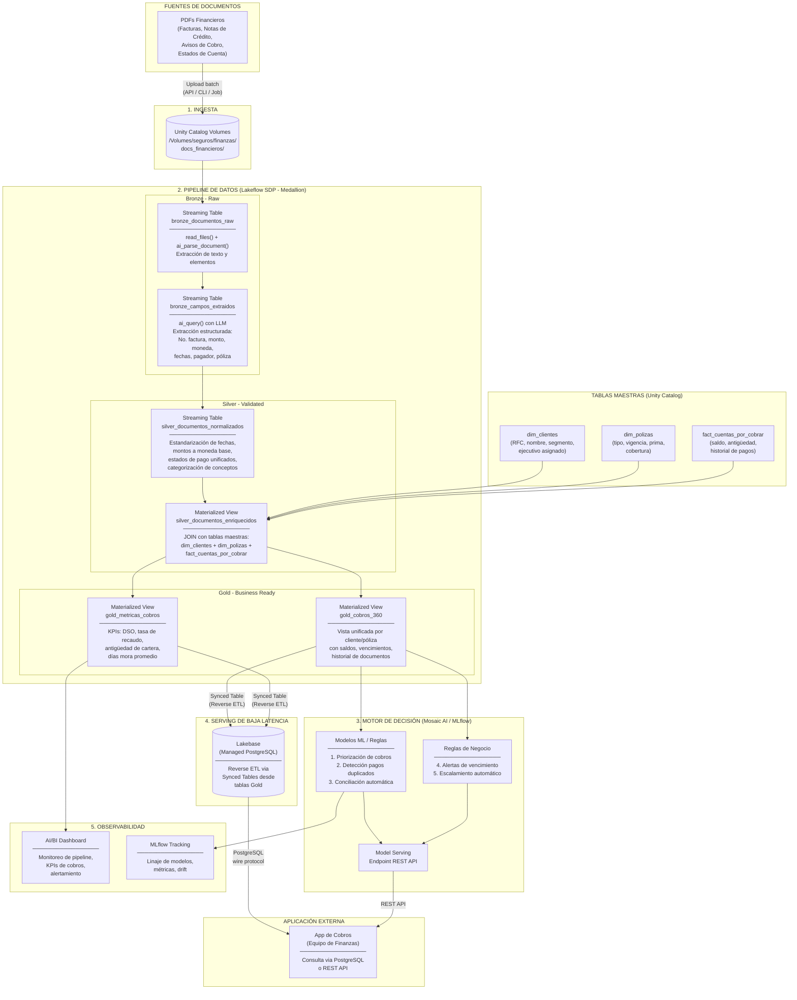
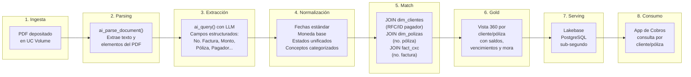
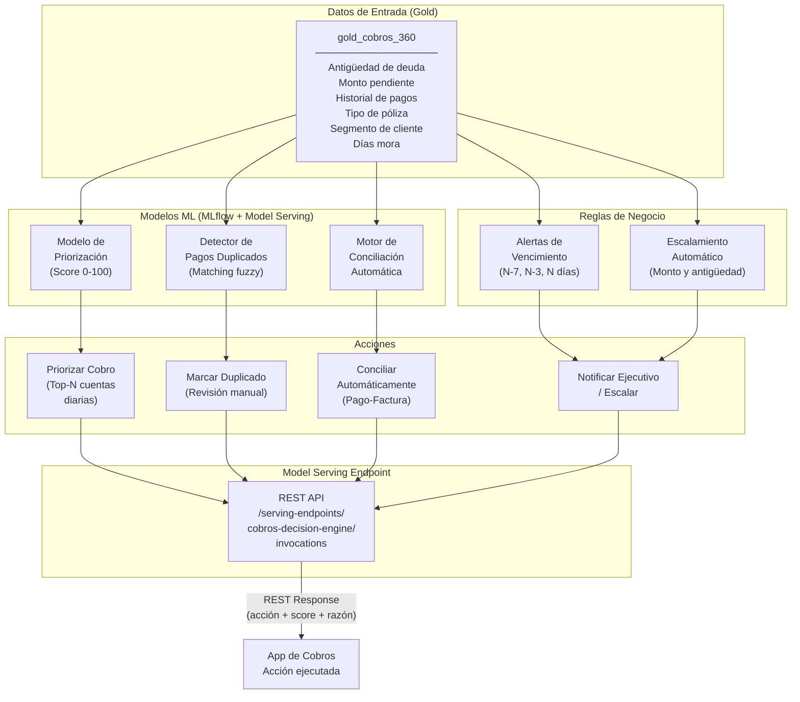

# Arquitectura de Referencia: Gestión Documental Financiera en Databricks

> Documento de arquitectura end-to-end para el departamento de finanzas y cobros
> de una empresa de seguros. Cubre desde la ingesta de documentos financieros (PDFs)
> hasta la exposición de datos normalizados en una aplicación externa de baja latencia,
> incluyendo un motor de decisión con ML para priorización de cobros, detección de
> pagos duplicados, alertas de vencimiento y conciliación automática.
>
> **Stack**: 100% Databricks — Unity Catalog, ai_parse_document, ai_query,
> Lakeflow SDP, Lakebase, Model Serving, AI/BI Dashboards.

---

## Tabla de Contenidos

1. [Diagrama de Arquitectura de Alto Nivel](#1-diagrama-de-arquitectura-de-alto-nivel)
2. [Descripción de Cada Capa y Componente](#2-descripción-de-cada-capa-y-componente)
3. [Flujo de Asociación: PDF a App Externa](#3-flujo-de-asociación-pdf-a-app-externa)
4. [Flujo del Motor de Decisión](#4-flujo-del-motor-de-decisión)
5. [Componentes Databricks Utilizados](#5-componentes-databricks-utilizados)
6. [Código de Referencia del Pipeline](#6-código-de-referencia-del-pipeline)

---

## 1. Diagrama de Arquitectura de Alto Nivel



---

## 2. Descripción de Cada Capa y Componente

### Capa 1: Ingesta — Unity Catalog Volumes

| Aspecto | Detalle |
|---------|---------|
| **Componente** | Unity Catalog Volumes |
| **Ruta** | `/Volumes/seguros/finanzas/docs_financieros/` |
| **Formatos** | PDF (facturas, notas de crédito, avisos de cobro, estados de cuenta) |
| **Gobernanza** | Control de acceso granular, linaje automático, auditoría via UC |

Los PDFs financieros llegan al Volume por tres vías posibles:

- **Carga programada**: Databricks Job que mueve archivos desde un sistema documental o blob storage (S3, ADLS, GCS) al Volume
- **API directa**: `upload_to_volume()` desde sistemas upstream del ERP o sistema contable
- **Carga manual**: via UI de Databricks para documentos puntuales

El pipeline SDP consume los archivos **incrementalmente** con `read_files()` en modo streaming
con checkpoints, garantizando procesamiento exactamente-una-vez. Archivos ya procesados
no se vuelven a leer en ejecuciones posteriores.

Unity Catalog provee gobernanza completa: permisos por Volume/carpeta, linaje desde el archivo
PDF original hasta las tablas derivadas, y auditoría de acceso.

---

### Capa 2: Pipeline de Datos — Lakeflow SDP (Medallion)

El pipeline se implementa con **Lakeflow Spark Declarative Pipelines (SDP)** usando compute
serverless y arquitectura medallion (bronze / silver / gold).

#### Bronze: Extracción de Documentos

**`bronze_documentos_raw`** (Streaming Table)

| Aspecto | Detalle |
|---------|---------|
| **Entrada** | PDFs binarios desde UC Volume |
| **Función AI** | `ai_parse_document(content)` |
| **Salida** | VARIANT con texto estructurado por elementos (párrafos, tablas, figuras) |
| **Metadatos** | `path`, `_ingested_at`, `_source_file` |

Lee los PDFs con `read_files()` en formato `binaryFile`. Aplica `ai_parse_document()` para
convertir cada PDF en un documento estructurado con elementos individuales (texto, tablas,
figuras), preservando la posición y tipo de cada elemento.

**`bronze_campos_extraidos`** (Streaming Table)

| Aspecto | Detalle |
|---------|---------|
| **Función AI** | `ai_query('databricks-claude-sonnet-4', prompt, returnType => 'STRUCT<...>')` |
| **Salida** | Campos clave extraídos como STRUCT tipado |

Concatena los elementos de texto del documento parseado y aplica `ai_query()` con un LLM
para extraer campos clave de manera estructurada:

| Campo | Descripción | Ejemplo |
|-------|-------------|---------|
| `numero_factura` | Identificador del documento | `FAC-2026-001234` |
| `tipo_documento` | Clasificación del documento | `factura`, `nota_credito`, `aviso_cobro` |
| `fecha_emision` | Fecha de emisión del documento | `2026-03-01` |
| `fecha_vencimiento` | Fecha límite de pago | `2026-04-01` |
| `monto_total` | Monto total del documento | `1,250,000.00` |
| `moneda` | Moneda del documento | `CRC`, `USD` |
| `impuestos` | Monto de impuestos | `162,500.00` |
| `nombre_pagador` | Nombre del pagador/deudor | `Seguros del Pacífico S.A.` |
| `id_pagador` | Identificación fiscal del pagador | `3-101-123456` |
| `nombre_beneficiario` | Nombre del beneficiario | `Hospital Nacional` |
| `concepto` | Descripción del cobro | `Prima de seguro vehicular` |
| `estado_pago` | Estado actual del pago | `pendiente`, `pagado` |
| `numero_poliza` | Póliza asociada al documento | `POL-VH-2026-5678` |

#### Silver: Normalización y Enriquecimiento

**`silver_documentos_normalizados`** (Streaming Table)

Estandariza los campos crudos extraídos en bronze:

| Campo | Transformación |
|-------|---------------|
| `fecha_emision`, `fecha_vencimiento` | `to_date()` con múltiples patrones (dd/MM/yyyy, yyyy-MM-dd, etc.) |
| `monto_total`, `impuestos` | `CAST(regexp_replace(...) AS DECIMAL(15,2))`, conversión a moneda base |
| `tipo_documento` | Categorización a catálogo cerrado: `factura`, `nota_credito`, `aviso_cobro`, `estado_cuenta` |
| `estado_pago` | Unificación: `PENDIENTE`, `PARCIAL`, `PAGADO`, `VENCIDO`, `EN_DISPUTA` |
| `concepto` | Categorización por taxonomía: `prima`, `siniestro`, `comision`, `honorarios`, `otro` |
| `nombre_pagador` | `initcap(trim(...))` para formato consistente |

Aplica validaciones de calidad:
- Monto > 0
- Fecha de vencimiento >= fecha de emisión
- Número de factura con formato válido
- Estado de pago en catálogo permitido

Registros inválidos se marcan con `_quality_flag` pero no se eliminan (para auditoría).

**`silver_documentos_enriquecidos`** (Materialized View)

Este es el punto de **asociación clave** — vincula cada documento financiero parseado con
los datos maestros de la aseguradora:

| JOIN | Clave | Datos Obtenidos |
|------|-------|-----------------|
| `dim_clientes` | RFC/ID del pagador o nombre | `cliente_id`, segmento, ejecutivo asignado, contacto |
| `dim_polizas` | `numero_poliza` | Tipo de póliza, vigencia, prima, cobertura |
| `fact_cuentas_por_cobrar` | Número de factura o póliza | Saldo pendiente, antigüedad, historial de pagos |

```
silver_documentos_normalizados
  LEFT JOIN dim_clientes      ON id_pagador = dim_clientes.identificacion
  LEFT JOIN dim_polizas        ON numero_poliza = dim_polizas.numero_poliza
  LEFT JOIN fact_cuentas_por_cobrar ON numero_factura = fact_cxc.referencia_documento
```

Incluye validaciones de vigencia de póliza, cobertura activa y estado de cuenta del cliente.

#### Gold: Vistas de Negocio

**`gold_cobros_360`** (Materialized View)

Vista unificada por cliente/póliza con:
- Todos los documentos financieros asociados (facturas, notas de crédito, avisos)
- Saldo total pendiente y documentos vencidos
- Días promedio de mora
- Último pago recibido y próxima fecha de vencimiento
- Flag de riesgo basado en antigüedad y monto

Optimizada con `CLUSTER BY (cliente_id, fecha_vencimiento)` para consultas frecuentes del
equipo de cobros.

**`gold_metricas_cobros`** (Materialized View)

KPIs agregados para reportes gerenciales:

| KPI | Descripción |
|-----|-------------|
| **DSO** (Days Sales Outstanding) | Días promedio de cobro |
| **Tasa de recaudo** | % de monto cobrado vs. facturado por período |
| **Antigüedad de cartera** | Distribución por rangos: 0-30, 31-60, 61-90, >90 días |
| **Días mora promedio** | Promedio de días de retraso en pagos |
| **Concentración** | % de cartera por los top-N clientes |
| **Tendencia mensual** | Evolución de cartera pendiente mes a mes |

Segmentación por ejecutivo de cobros, región, tipo de póliza y segmento de cliente.

---

### Capa 3: Motor de Decisión — Mosaic AI + MLflow

Dos aproximaciones complementarias alimentadas desde las tablas Gold:

#### Modelos ML (MLflow + Model Serving)

| Modelo | Tipo | Entrada | Salida |
|--------|------|---------|--------|
| **Priorización de cobros** | XGBoost / LightGBM | Antigüedad, monto, historial, tipo póliza, segmento | Score 0-100 (probabilidad de pago) |
| **Detección de pagos duplicados** | Reglas + Matching fuzzy | Monto, fecha, pagador, referencia | Flag duplicado + score de similitud |
| **Conciliación automática** | Clasificación supervisada | Pago recibido + factura pendiente | Match automático pago-factura |

Los modelos se entrenan con datos históricos, se registran en **Unity Catalog Model Registry**
con versionado y linaje, y se despliegan como **Model Serving Endpoints** (REST API).

#### Reglas de Negocio

| Regla | Condición | Acción |
|-------|-----------|--------|
| **Alerta pre-vencimiento** | Documento vence en N-7 días | Notificar al ejecutivo asignado |
| **Alerta de vencimiento** | Documento vence en N-3 días | Notificación urgente + aviso al cliente |
| **Alerta post-vencimiento** | Documento vencido (día N) | Escalar al supervisor |
| **Escalamiento por monto** | Monto > umbral definido | Escalar a gerencia |
| **Escalamiento por antigüedad** | Mora > 90 días | Transferir a cobranza jurídica |

Implementadas como reglas parametrizables en el pipeline o como parte del endpoint de
Model Serving para evaluación en tiempo real.

#### Ciclo de Vida del Modelo

```
Datos Gold ──► MLflow Experiment ──► Model Registry (UC) ──► Model Serving Endpoint
                  (tracking)           (versionado)           (REST API)
                      │                     │                      │
                      ▼                     ▼                      ▼
               Métricas de            A/B testing            Inferencia
               evaluación           entre versiones         en tiempo real
```

---

### Capa 4: Serving de Baja Latencia — Lakebase

| Aspecto | Detalle |
|---------|---------|
| **Componente** | Lakebase Provisioned (Managed PostgreSQL) |
| **Latencia** | < 10ms para point lookups OLTP |
| **Sincronización** | Reverse ETL via Synced Tables desde tablas Gold |
| **Tablas sincronizadas** | `gold_cobros_360`, `gold_metricas_cobros` |
| **Modo de sync** | `CONTINUOUS` (segundos de latencia) o `TRIGGERED` (bajo demanda) |
| **Autenticación** | OAuth token (1h expiry, refresh automático) |
| **Protocolo** | PostgreSQL wire protocol, `sslmode=require` |

La aplicación externa del equipo de cobros consulta directamente Lakebase con latencia
sub-segundo. Patrones de acceso típicos:

- **Por cliente**: `SELECT * FROM cobros_360 WHERE cliente_id = ?`
- **Por ejecutivo**: `SELECT * FROM cobros_360 WHERE ejecutivo = ? AND estado = 'VENCIDO'`
- **KPIs en tiempo real**: `SELECT * FROM metricas_cobros WHERE mes = CURRENT_DATE`

**Requisito**: Habilitar Change Data Feed (CDF) en las tablas fuente Gold para que
las Synced Tables puedan detectar cambios incrementales.

---

### Capa 5: Observabilidad

#### AI/BI Dashboard

Dashboard nativo de Databricks con dos secciones:

**Métricas operacionales:**
- Documentos procesados por hora/día
- Tasa de error de parsing (`ai_parse_document`)
- Tasa de extracción exitosa (`ai_query`)
- Latencia end-to-end del pipeline

**Métricas de negocio:**
- Cartera total pendiente y tendencia
- DSO y tasa de recaudo por período
- Distribución de antigüedad de cartera
- Top clientes morosos
- Efectividad de cobros por ejecutivo

#### MLflow Tracking

- Linaje y versionado de modelos de priorización y conciliación
- Métricas de evaluación (AUC, precision, recall del modelo de priorización)
- Monitoreo de drift sobre features del modelo
- Comparación de versiones para A/B testing

---

## 3. Flujo de Asociación: PDF a App Externa



### Detalle paso a paso

| Paso | Componente | Acción |
|------|-----------|--------|
| 1 | UC Volume | El PDF (factura, nota de crédito, aviso de cobro, estado de cuenta) llega al Volume. Puede ser carga batch programada o puntual via API. |
| 2 | `ai_parse_document()` | Convierte el PDF binario a texto estructurado por elementos (párrafos, tablas, figuras). Soporta PDFs multi-página con tablas complejas. |
| 3 | `ai_query()` + LLM | Extrae campos clave en formato STRUCT tipado: `numero_factura`, `monto_total`, `moneda`, `fecha_emision`, `fecha_vencimiento`, `nombre_pagador`, `id_pagador`, `numero_poliza`, `concepto`, `estado_pago`. |
| 4 | Silver — Normalización | Estandariza fechas a formato ISO, convierte montos a moneda base (usando tipo de cambio del día), unifica estados de pago a catálogo cerrado, categoriza conceptos en taxonomía de la aseguradora. |
| 5 | Silver — Enriquecimiento | **Punto de asociación clave.** JOIN con `dim_clientes` por RFC/ID del pagador para obtener `cliente_id`, segmento y ejecutivo. JOIN con `dim_polizas` por número de póliza para tipo, vigencia y prima. JOIN con `fact_cuentas_por_cobrar` por número de factura para saldo y antigüedad. |
| 6 | Gold — Vista 360 | Consolida la vista unificada por cliente/póliza: todos los documentos asociados, saldo total pendiente, documentos vencidos, días de mora, próximo vencimiento. |
| 7 | Lakebase — Reverse ETL | Synced Table replica los datos Gold a PostgreSQL en modo continuo. Latencia de sincronización: segundos. |
| 8 | App de Cobros | La aplicación externa consulta Lakebase con latencia sub-segundo via protocolo PostgreSQL estándar. Búsquedas por `cliente_id`, ejecutivo, estado de pago, rango de fechas. |

---

## 4. Flujo del Motor de Decisión



### Detalle de cada componente del motor

#### 1. Priorización de Cobros (Modelo ML)

- **Algoritmo**: XGBoost o LightGBM entrenado con datos históricos de cobros
- **Features**: antigüedad de la deuda, monto pendiente, historial de pagos del cliente,
  tipo de póliza, segmento del cliente, número de documentos vencidos, tendencia de pago
- **Salida**: Score de probabilidad de pago (0-100). El equipo de cobros trabaja las
  cuentas con score más bajo (menor probabilidad de pago voluntario) diariamente
- **Reentrenamiento**: Mensual, con validación de drift via MLflow

#### 2. Detección de Pagos Duplicados (Reglas + ML)

- **Método**: Matching fuzzy (distancia de Levenshtein, cosine similarity) entre documentos
- **Criterios**: montos similares (tolerancia ±1%), fechas próximas (±3 días),
  mismo pagador (similitud nombre > 90%)
- **Salida**: Flag de posible duplicado + score de similitud. Los duplicados probables
  se marcan para revisión manual por el analista de cobros

#### 3. Conciliación Automática (Modelo de Clasificación)

- **Problema**: Dado un pago recibido (extracto bancario), encontrar la(s) factura(s)
  correspondiente(s) pendientes de pago
- **Features**: monto del pago vs. monto de factura, referencia del pago, nombre del pagador,
  fecha del pago vs. fecha de vencimiento
- **Salida**: Match automático pago-factura con score de confianza. Matches con
  confianza > 95% se concilian automáticamente; el resto va a revisión manual

#### 4. Alertas de Vencimiento (Reglas de Negocio)

| Regla | Ventana | Acción |
|-------|---------|--------|
| Pre-vencimiento | N-7 días | Recordatorio automático al cliente |
| Urgencia | N-3 días | Notificación al ejecutivo de cobros |
| Vencimiento | Día N | Alerta al supervisor + cambio de estado a `VENCIDO` |
| Mora temprana | N+15 días | Llamada de cobro programada |
| Mora avanzada | N+60 días | Escalamiento a cobranza externa |
| Mora crítica | N+90 días | Transferencia a área jurídica |

#### 5. Escalamiento Automático (Reglas de Negocio)

| Condición | Acción |
|-----------|--------|
| Monto > umbral_nivel_1 | Escalar a supervisor de cobros |
| Monto > umbral_nivel_2 | Escalar a gerente de finanzas |
| Mora > 90 días + monto > umbral | Escalar a dirección + área jurídica |
| Cliente VIP con mora > 30 días | Atención personalizada por ejecutivo senior |

---

## 5. Componentes Databricks Utilizados

| Componente | Servicio Databricks | Propósito | Capa |
|------------|---------------------|-----------|------|
| Almacén de documentos | **Unity Catalog Volumes** | Repositorio gobernado de PDFs financieros | Ingesta |
| Parsing de PDFs | **`ai_parse_document()`** (DBSQL AI Function) | Extracción de texto/tablas desde PDFs binarios | Bronze |
| Extracción de campos | **`ai_query()`** con LLM (DBSQL AI Function) | Extracción estructurada de campos con IA generativa | Bronze |
| Categorización | **`ai_classify()`** (DBSQL AI Function) | Clasificación de conceptos y tipos de documento | Silver |
| Pipeline de datos | **Lakeflow Spark Declarative Pipelines** (SDP) | Orquestación medallion Bronze → Silver → Gold | Pipeline |
| Scheduling | **Databricks Workflows** | Ejecución programada incremental del pipeline | Orquestación |
| Tablas maestras | **Unity Catalog** (Delta Tables) | Gobernanza de datos maestros (clientes, pólizas, CxC) | Transversal |
| Entrenamiento ML | **MLflow** + **Mosaic AI** | Experiment tracking, registro y versionado de modelos | Decisión |
| Inferencia | **Model Serving** | Endpoint REST para el motor de decisión en tiempo real | Decisión |
| Serving baja latencia | **Lakebase** (Managed PostgreSQL) | Consultas OLTP sub-segundo para la app de cobros | Serving |
| Reverse ETL | **Synced Tables** (Lakebase) | Replicación continua de tablas Gold a PostgreSQL | Serving |
| Dashboards | **AI/BI Dashboards** | Monitoreo operacional y KPIs de cobros para gerencia | Observabilidad |
| Gobernanza | **Unity Catalog** | Linaje end-to-end, permisos granulares, auditoría | Transversal |

---

## 6. Código de Referencia del Pipeline

### Estructura del Proyecto (Lakeflow SDP con Asset Bundles)

```
insurance-finanzas-cobros-architecture/
├── README.md                                    # Este documento
├── pipeline/
│   ├── databricks.yml                           # Config multi-entorno (dev/prod)
│   ├── resources/
│   │   └── finanzas_cobros_etl.pipeline.yml     # Definición del pipeline
│   └── src/
│       └── finanzas_cobros_etl/
│           └── transformations/
│               ├── bronze/
│               │   ├── bronze_documentos_raw.sql
│               │   └── bronze_campos_extraidos.sql
│               ├── silver/
│               │   ├── silver_documentos_normalizados.sql
│               │   └── silver_documentos_enriquecidos.sql
│               └── gold/
│                   ├── gold_cobros_360.sql
│                   └── gold_metricas_cobros.sql
├── serving/
│   └── reverse_etl_setup.py                     # Configuración Lakebase + Synced Tables
└── ml/
    ├── train_priorizacion.py                    # Entrenamiento modelo de priorización
    └── train_conciliacion.py                    # Entrenamiento modelo de conciliación
```

Los archivos SQL del pipeline, scripts de Reverse ETL y modelos ML se encuentran
en sus respectivos directorios dentro de este repositorio. Consulte cada archivo
para la implementación detallada.
