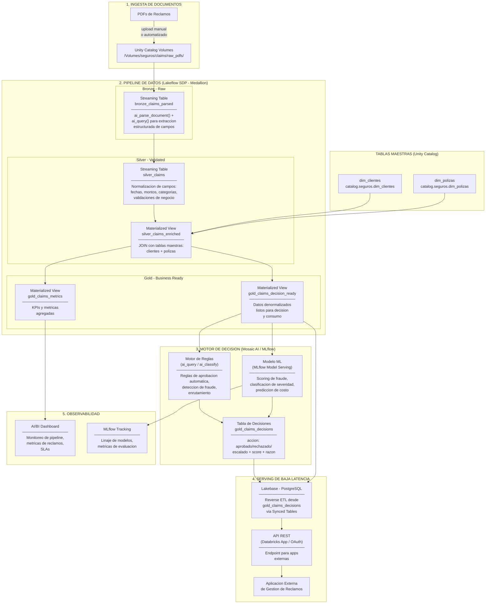
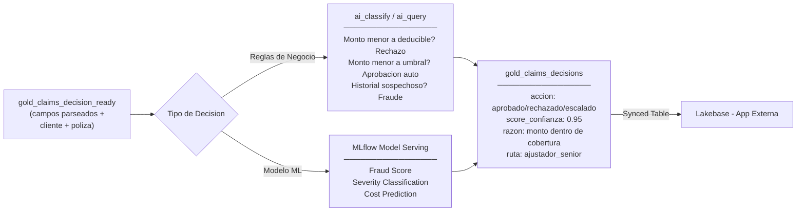

# Arquitectura de Referencia: Gestion de Reclamos de Seguros en Databricks

> Documento de arquitectura end-to-end para el proceso de gestion de reclamos (claims)
> de una empresa de seguros, utilizando exclusivamente componentes de la plataforma Databricks.

---

## Tabla de Contenidos

1. [Diagrama de Arquitectura de Alto Nivel](#1-diagrama-de-arquitectura-de-alto-nivel)
2. [Descripcion de Cada Capa y Componente](#2-descripcion-de-cada-capa-y-componente)
3. [Flujo de Asociacion: PDF a App Externa](#3-flujo-de-asociacion-pdf-a-app-externa)
4. [Flujo del Motor de Decision](#4-flujo-del-motor-de-decision)
5. [Componentes Databricks Utilizados](#5-componentes-databricks-utilizados)
6. [Codigo de Referencia del Pipeline](#6-codigo-de-referencia-del-pipeline)

---

## 1. Diagrama de Arquitectura de Alto Nivel



---

## 2. Descripcion de Cada Capa y Componente

### Capa 1: Ingesta de Documentos

| Aspecto | Detalle |
|---------|---------|
| **Componente** | Unity Catalog Volumes |
| **Ruta** | `/Volumes/seguros/claims/raw_pdfs/` |
| **Formatos** | PDF (principal), DOCX, imagenes JPG/PNG |
| **Gobernanza** | Control de acceso, linaje y auditoria via Unity Catalog |

Los PDFs de reclamos llegan al Volume por tres vias posibles:

- **Carga manual**: via UI de Databricks o API REST de Volumes
- **Automatizacion**: Databricks Job programado que mueve archivos desde un blob storage externo (S3, ADLS, GCS)
- **API directa**: `upload_to_volume()` desde sistemas upstream

Unity Catalog provee gobernanza sobre los archivos fuente: control de acceso granular, linaje de datos desde el archivo original hasta las tablas derivadas, y auditoria completa de quien accede a los documentos.

### Capa 2: Pipeline de Datos (Lakeflow SDP - Medallion)

El pipeline se implementa con **Lakeflow Spark Declarative Pipelines (SDP)** usando compute serverless y arquitectura medallion (bronze / silver / gold).

#### Bronze: Extraccion Cruda

| Aspecto | Detalle |
|---------|---------|
| **Tabla** | `bronze_claims_parsed` (Streaming Table) |
| **Funcion AI** | `ai_parse_document()` + `ai_query()` |
| **Entrada** | PDFs binarios desde UC Volume |
| **Salida** | Texto completo + campos extraidos como STRUCT |

Lee los PDFs desde el Volume usando `read_files()` con formato `binaryFile`. Aplica `ai_parse_document()` para convertir el PDF a texto estructurado por elementos (parrafos, tablas, figuras). Luego `ai_query()` con un LLM extrae los campos clave del reclamo:

- Numero de poliza (`policy_number`)
- Fecha del siniestro (`incident_date`)
- Tipo de reclamo (`claim_type`)
- Monto reclamado (`claimed_amount`)
- Nombre del asegurado (`insured_name`)
- Identificacion del asegurado (`insured_id`)
- Descripcion del incidente (`incident_description`)
- Ubicacion del incidente (`incident_location`)

Los campos se retornan como un `STRUCT` tipado para facilitar su procesamiento downstream.

#### Silver: Validacion y Normalizacion

**`silver_claims`** (Streaming Table)

Normaliza los campos crudos extraidos en bronze:

| Campo | Transformacion |
|-------|---------------|
| `incident_date` | `try_cast(... AS DATE)` con formatos multiples |
| `claimed_amount` | `CAST(regexp_replace(...) AS DECIMAL(12,2))` |
| `claim_type` | Estandarizacion a catalogo: vehicular, salud, propiedad, vida, responsabilidad_civil |
| `insured_name` | `initcap(trim(...))` para formato consistente |
| `policy_number` | Validacion con regex del formato esperado |

Aplica validaciones de calidad: monto > 0, fecha dentro de rango valido, poliza con formato correcto. Los registros que no pasan se marcan con `_quality_flag = 'invalid'` pero no se eliminan.

**`silver_claims_enriched`** (Materialized View)

JOIN con tablas maestras de Unity Catalog:

```
silver_claims
  JOIN dim_polizas    ON silver_claims.policy_number = dim_polizas.policy_number
  JOIN dim_clientes   ON dim_polizas.cliente_id = dim_clientes.cliente_id
```

Este es el punto de **asociacion clave**: vincula cada reclamo parseado con la informacion completa del asegurado (nombre, contacto, historial de reclamos previos) y la poliza (tipo de cobertura, vigencia, deducible, limite de cobertura).

#### Gold: Datos Listos para Negocio

**`gold_claims_decision_ready`** (Materialized View)

Vista denormalizada con todos los campos necesarios para el motor de decision:
- Datos del reclamo (campos extraidos y normalizados)
- Datos del cliente (nombre, historial, segmento)
- Datos de la poliza (cobertura, vigencia, deducible, limite)
- Flags de validacion y calidad

**`gold_claims_metrics`** (Materialized View)

Agregaciones para dashboards y reportes:
- Reclamos por tipo y estado
- Monto promedio reclamado por categoria
- Tiempo promedio de procesamiento
- Tasas de aprobacion/rechazo/escalamiento
- Distribucion geografica de siniestros

### Capa 3: Motor de Decision (Mosaic AI / MLflow)

Dos aproximaciones complementarias alimentadas desde `gold_claims_decision_ready`:

#### Motor de Reglas (AI Functions)

Usa `ai_classify()` o `ai_query()` dentro del pipeline SDP o como paso adicional en un Databricks Job para clasificar reclamos segun reglas de negocio:

| Condicion | Accion |
|-----------|--------|
| `claimed_amount <= deductible` | Rechazo automatico |
| `claimed_amount < auto_approval_threshold AND fraud_score < 0.3` | Aprobacion automatica |
| `fraud_score >= 0.7` | Escalamiento a investigacion |
| Resto | Revision manual por ajustador |

#### Modelo ML (MLflow Model Serving)

Un modelo de clasificacion registrado en MLflow y servido via Mosaic AI Model Serving:

| Capacidad | Descripcion |
|-----------|-------------|
| **Fraud Score** | Probabilidad de fraude (0.0 - 1.0) basada en patrones historicos |
| **Severity Classification** | Clasificacion de severidad: baja, media, alta, catastrofica |
| **Cost Prediction** | Estimacion del costo final del reclamo |

El modelo se entrena con datos historicos de reclamos y se despliega como endpoint REST con versionado y A/B testing.

#### Tabla de Decisiones

**`gold_claims_decisions`**: consolida los resultados del motor de reglas y el modelo ML:

| Campo | Ejemplo |
|-------|---------|
| `claim_id` | `CLM-2026-001234` |
| `decision_action` | `aprobado` / `rechazado` / `escalado` |
| `confidence_score` | `0.95` |
| `decision_reason` | `Monto dentro de cobertura, sin indicadores de fraude` |
| `routing` | `ajustador_senior` / `investigacion` / `auto_pago` |
| `fraud_score` | `0.12` |
| `estimated_cost` | `2,500,000.00` |
| `decided_at` | `2026-03-16T10:30:00Z` |

### Capa 4: Serving de Baja Latencia

#### Lakebase (Managed PostgreSQL)

| Aspecto | Detalle |
|---------|---------|
| **Tipo** | Lakebase Provisioned (PostgreSQL managed) |
| **Latencia** | < 10ms para consultas OLTP |
| **Sincronizacion** | Reverse ETL via Synced Tables desde tablas gold |
| **Tablas sincronizadas** | `gold_claims_decisions`, `gold_claims_decision_ready` |
| **Autenticacion** | OAuth token (1h expiry, refresh automatico) |
| **Protocolo** | PostgreSQL wire protocol, `sslmode=require` |

Se alimenta mediante **Reverse ETL con Synced Tables**: una sincronizacion continua o triggered desde las tablas Delta gold hacia PostgreSQL en Lakebase. Esto permite que aplicaciones externas consulten datos normalizados con latencia de milisegundos.

#### Databricks App (API REST)

Capa opcional que expone endpoints REST autenticados via OAuth sobre Lakebase:

- `GET /api/claims/{claim_id}` - Detalle de un reclamo
- `GET /api/claims?status=pending` - Lista de reclamos por estado
- `GET /api/claims/{claim_id}/decision` - Decision y score de un reclamo
- `POST /api/claims/{claim_id}/override` - Override manual de decision

Implementada con FastAPI sobre Databricks Apps, con conexion directa a Lakebase usando SQLAlchemy + psycopg3.

#### Aplicacion Externa

El sistema de gestion de reclamos de la aseguradora consume datos por dos vias:
- **API REST**: via los endpoints de Databricks App
- **Conexion directa**: PostgreSQL wire protocol a Lakebase con OAuth

### Capa 5: Observabilidad

#### AI/BI Dashboard

Dashboard nativo de Databricks con:
- **Metricas operacionales**: documentos procesados, errores de parsing, latencia del pipeline
- **Metricas de negocio**: reclamos por estado, montos totales, distribucion por tipo
- **SLAs**: tiempo de procesamiento end-to-end, porcentaje de decisiones automaticas

#### MLflow Tracking

- Linaje y versionado de modelos de decision
- Metricas de evaluacion (precision, recall, F1 del clasificador de fraude)
- Comparacion de versiones de modelos
- Drift monitoring sobre features del modelo

---

## 3. Flujo de Asociacion: PDF a App Externa

```mermaid
flowchart LR
    A["PDF del Reclamo\nen UC Volume"] -->|"ai_parse_document\n+ ai_query"| B["Campos Extraidos\n(bronze)"]
    B -->|"Normalizacion\nde campos"| C["Campos Normalizados\n(silver_claims)"]
    C -->|"JOIN policy_number\n+ cliente_id"| D["Reclamo + Cliente + Poliza\n(silver_claims_enriched)"]
    D -->|"Denormalizacion"| E["gold_claims_decision_ready"]
    E -->|"Reverse ETL\nSynced Table"| F["Lakebase\n(PostgreSQL)"]
    F -->|"API REST\no wire protocol"| G["App Externa\nde Gestion"]
```



### Detalle paso a paso

| Paso | Componente | Accion |
|------|-----------|--------|
| 1 | `ai_parse_document()` | Convierte el PDF binario a texto estructurado por elementos |
| 2 | `ai_query()` | Extrae `policy_number`, `insured_name`, `claimed_amount` y demas campos del texto |
| 3 | `silver_claims` | Normaliza formatos: `incident_date` a DATE, `claimed_amount` a DECIMAL, `claim_type` a catalogo estandar |
| 4 | `silver_claims_enriched` | JOIN con `dim_polizas ON policy_number` para obtener datos de la poliza (cobertura, vigencia, deducible) |
| 5 | `silver_claims_enriched` | JOIN con `dim_clientes ON cliente_id` (via poliza) para obtener datos del asegurado (nombre, contacto, historial) |
| 6 | `gold_claims_decision_ready` | Denormaliza todo en una vista lista para consumo |
| 7 | Synced Table | Sincroniza la tabla gold a Lakebase via Reverse ETL |
| 8 | Lakebase | Sirve los datos con latencia < 10ms via PostgreSQL wire protocol |
| 9 | App Externa | Consume via API REST o conexion directa |

---

## 4. Flujo del Motor de Decision



### Matriz de Decision

| Condicion | Accion | Ruta |
|-----------|--------|------|
| `claimed_amount <= deductible` | Rechazo automatico | Notificacion al asegurado |
| `claimed_amount < umbral_aprobacion AND fraud_score < 0.3` | Aprobacion automatica | Auto-pago |
| `fraud_score >= 0.7` | Escalamiento | Unidad de investigacion |
| `severity = 'catastrofica'` | Escalamiento | Ajustador senior + gerencia |
| Cualquier otro caso | Revision manual | Cola de ajustadores |

### Implementacion del Motor de Reglas con AI Functions

```sql
-- Clasificacion con ai_classify()
SELECT
  claim_id,
  ai_classify(
    concat(
      'Claim type: ', claim_type,
      ', Amount: ', claimed_amount,
      ', Coverage limit: ', coverage_limit,
      ', Deductible: ', deductible,
      ', Prior claims: ', prior_claims_count,
      ', Description: ', incident_description
    ),
    ARRAY('auto_approve', 'manual_review', 'fraud_investigation', 'reject')
  ) AS ai_decision
FROM gold_claims_decision_ready
WHERE decision_action IS NULL;
```

### Implementacion del Modelo ML

```python
import mlflow
from mlflow.models import infer_signature

mlflow.set_registry_uri("databricks-uc")

with mlflow.start_run():
    model = train_fraud_classifier(X_train, y_train)

    signature = infer_signature(X_train, model.predict(X_train))
    mlflow.sklearn.log_model(
        model,
        artifact_path="fraud_model",
        signature=signature,
        registered_model_name="seguros.claims.fraud_classifier",
        input_example=X_train[:5]
    )
```

Despliegue via Mosaic AI Model Serving como endpoint REST con scoring en batch o en tiempo real.

---

## 5. Componentes Databricks Utilizados

| Componente | Rol en la Arquitectura | Capa |
|---|---|---|
| **Unity Catalog Volumes** | Almacen de PDFs con gobernanza, linaje y control de acceso | Ingesta |
| **ai_parse_document()** | Extraccion de texto estructurado desde PDFs binarios | Bronze |
| **ai_query()** | Extraccion de campos clave del reclamo via LLM con returnType tipado | Bronze |
| **ai_classify()** | Clasificacion de reclamos segun reglas de negocio | Decision |
| **Lakeflow SDP (serverless)** | Orquestacion del pipeline medallion con compute serverless | Pipeline |
| **Streaming Tables** | Tablas incrementales en bronze y silver para procesamiento continuo | Pipeline |
| **Materialized Views** | Vistas materializadas en silver/gold con refresh automatico | Pipeline |
| **Unity Catalog Tables** | Tablas maestras `dim_clientes` y `dim_polizas` con gobernanza | Maestras |
| **MLflow Tracking** | Registro, versionado y evaluacion de modelos ML | Decision |
| **Mosaic AI Model Serving** | Serving del modelo de fraude/severidad como endpoint REST | Decision |
| **Lakebase (Managed PostgreSQL)** | Base de datos operacional OLTP con latencia < 10ms | Serving |
| **Synced Tables (Reverse ETL)** | Sincronizacion continua Delta Lake a Lakebase | Serving |
| **Databricks App (FastAPI)** | API REST autenticada sobre Lakebase para apps externas | Serving |
| **AI/BI Dashboard** | Monitoreo operacional y metricas de negocio | Observabilidad |

---

## 6. Codigo de Referencia del Pipeline

### Estructura del Proyecto (Lakeflow SDP con Asset Bundles)

```
insurance_claims_pipeline/
├── databricks.yml
├── resources/
│   └── claims_etl.pipeline.yml
└── src/
    └── claims_etl/
        └── transformations/
            ├── bronze_claims_parsed.sql
            ├── silver_claims.sql
            ├── silver_claims_enriched.sql
            ├── gold_claims_decision_ready.sql
            ├── gold_claims_metrics.sql
            └── gold_claims_decisions.sql
```

### Bronze: Extraccion de Campos desde PDFs

```sql
-- bronze_claims_parsed.sql
CREATE OR REFRESH STREAMING TABLE bronze_claims_parsed
CLUSTER BY (policy_number)
AS
WITH parsed AS (
  SELECT
    path,
    ai_parse_document(content) AS doc,
    current_timestamp() AS _ingested_at,
    _metadata.file_path AS _source_file
  FROM STREAM read_files(
    '/Volumes/seguros/claims/raw_pdfs/',
    format => 'binaryFile'
  )
),
text_extracted AS (
  SELECT
    path, _ingested_at, _source_file,
    concat_ws('\n\n',
      transform(
        try_cast(doc:document:elements AS ARRAY<VARIANT>),
        el -> try_cast(el:content AS STRING)
      )
    ) AS full_text
  FROM parsed
  WHERE try_cast(doc:error_status AS STRING) IS NULL
)
SELECT
  md5(path) AS claim_doc_id,
  path,
  _ingested_at,
  _source_file,
  full_text,
  ai_query(
    'databricks-claude-sonnet-4',
    concat(
      'Extract the following fields from this insurance claim document. ',
      'Return ONLY a valid JSON object with these keys: ',
      'policy_number, incident_date, claim_type, claimed_amount, ',
      'insured_name, insured_id, incident_description, incident_location. ',
      'If a field is not found, use null. Document:\n\n',
      full_text
    ),
    returnType => 'STRUCT<policy_number STRING, incident_date STRING,
      claim_type STRING, claimed_amount STRING, insured_name STRING,
      insured_id STRING, incident_description STRING,
      incident_location STRING>'
  ) AS extracted
FROM text_extracted
WHERE full_text IS NOT NULL
  AND length(trim(full_text)) > 50;
```

### Silver: Normalizacion de Campos

```sql
-- silver_claims.sql
CREATE OR REFRESH STREAMING TABLE silver_claims
CLUSTER BY (incident_date, claim_type)
AS
SELECT
  claim_doc_id,
  path,
  _ingested_at,

  extracted.policy_number,

  COALESCE(
    try_cast(extracted.incident_date AS DATE),
    try_cast(
      date_format(
        to_timestamp(extracted.incident_date, 'dd/MM/yyyy'), 'yyyy-MM-dd'
      ) AS DATE
    )
  ) AS incident_date,

  CASE
    WHEN lower(extracted.claim_type) RLIKE '.*(auto|vehic|carro|coche).*' THEN 'vehicular'
    WHEN lower(extracted.claim_type) RLIKE '.*(salud|medic|hospital).*' THEN 'salud'
    WHEN lower(extracted.claim_type) RLIKE '.*(propied|hogar|casa|incendio).*' THEN 'propiedad'
    WHEN lower(extracted.claim_type) RLIKE '.*(vida|fallec|muerte).*' THEN 'vida'
    WHEN lower(extracted.claim_type) RLIKE '.*(responsab|civil|tercero).*' THEN 'responsabilidad_civil'
    ELSE 'otro'
  END AS claim_type,

  try_cast(
    regexp_replace(extracted.claimed_amount, '[^0-9.]', '')
    AS DECIMAL(12,2)
  ) AS claimed_amount,

  initcap(trim(extracted.insured_name)) AS insured_name,
  trim(extracted.insured_id) AS insured_id,
  extracted.incident_description,
  extracted.incident_location,

  CASE
    WHEN extracted.policy_number IS NULL THEN 'missing_policy'
    WHEN try_cast(
           regexp_replace(extracted.claimed_amount, '[^0-9.]', '')
           AS DECIMAL(12,2)
         ) IS NULL OR
         try_cast(
           regexp_replace(extracted.claimed_amount, '[^0-9.]', '')
           AS DECIMAL(12,2)
         ) <= 0 THEN 'invalid_amount'
    WHEN COALESCE(
           try_cast(extracted.incident_date AS DATE),
           try_cast(
             date_format(
               to_timestamp(extracted.incident_date, 'dd/MM/yyyy'), 'yyyy-MM-dd'
             ) AS DATE
           )
         ) IS NULL THEN 'invalid_date'
    ELSE 'valid'
  END AS _quality_flag,

  current_timestamp() AS _processed_at

FROM STREAM(bronze_claims_parsed);
```

### Silver: Enriquecimiento con Datos Maestros

```sql
-- silver_claims_enriched.sql
CREATE OR REFRESH MATERIALIZED VIEW silver_claims_enriched
AS
SELECT
  c.claim_doc_id,
  c.path,
  c.policy_number,
  c.incident_date,
  c.claim_type,
  c.claimed_amount,
  c.insured_name,
  c.insured_id,
  c.incident_description,
  c.incident_location,
  c._quality_flag,
  c._processed_at,

  -- Datos de la poliza
  p.policy_type,
  p.coverage_start_date,
  p.coverage_end_date,
  p.deductible,
  p.coverage_limit,
  p.premium_amount,
  p.policy_status,

  -- Datos del cliente
  cl.cliente_id,
  cl.full_name AS client_full_name,
  cl.email AS client_email,
  cl.phone AS client_phone,
  cl.address AS client_address,
  cl.segment AS client_segment,
  cl.registration_date AS client_since,

  -- Validacion de vigencia
  CASE
    WHEN p.policy_number IS NULL THEN 'poliza_no_encontrada'
    WHEN p.policy_status != 'activa' THEN 'poliza_inactiva'
    WHEN c.incident_date < p.coverage_start_date
      OR c.incident_date > p.coverage_end_date THEN 'fuera_de_vigencia'
    WHEN c.claimed_amount > p.coverage_limit THEN 'excede_cobertura'
    ELSE 'vigente'
  END AS policy_validation

FROM silver_claims c
LEFT JOIN seguros.maestras.dim_polizas p
  ON c.policy_number = p.policy_number
LEFT JOIN seguros.maestras.dim_clientes cl
  ON p.cliente_id = cl.cliente_id
WHERE c._quality_flag = 'valid';
```

### Gold: Vista de Decision

```sql
-- gold_claims_decision_ready.sql
CREATE OR REFRESH MATERIALIZED VIEW gold_claims_decision_ready
AS
SELECT
  claim_doc_id,
  policy_number,
  incident_date,
  claim_type,
  claimed_amount,
  insured_name,
  insured_id,
  incident_description,
  incident_location,

  -- Poliza
  policy_type,
  deductible,
  coverage_limit,
  policy_status,
  policy_validation,

  -- Cliente
  cliente_id,
  client_full_name,
  client_segment,

  -- Campos calculados para decision
  claimed_amount - deductible AS net_claim_amount,
  CASE
    WHEN claimed_amount <= deductible THEN true
    ELSE false
  END AS below_deductible,
  CASE
    WHEN claimed_amount > coverage_limit THEN true
    ELSE false
  END AS exceeds_coverage,

  -- Historial (subquery para claims previos del mismo cliente)
  (
    SELECT COUNT(*)
    FROM silver_claims_enriched prev
    WHERE prev.cliente_id = silver_claims_enriched.cliente_id
      AND prev.claim_doc_id != silver_claims_enriched.claim_doc_id
  ) AS prior_claims_count,

  _processed_at

FROM silver_claims_enriched
WHERE policy_validation IN ('vigente', 'excede_cobertura');
```

### Gold: Metricas Agregadas

```sql
-- gold_claims_metrics.sql
CREATE OR REFRESH MATERIALIZED VIEW gold_claims_metrics
AS
SELECT
  date_trunc('MONTH', incident_date) AS month,
  claim_type,
  policy_type,
  client_segment,

  COUNT(*) AS total_claims,
  SUM(claimed_amount) AS total_claimed_amount,
  AVG(claimed_amount) AS avg_claimed_amount,
  MIN(claimed_amount) AS min_claimed_amount,
  MAX(claimed_amount) AS max_claimed_amount,
  COUNT(CASE WHEN below_deductible THEN 1 END) AS below_deductible_count,
  COUNT(CASE WHEN exceeds_coverage THEN 1 END) AS exceeds_coverage_count

FROM gold_claims_decision_ready
GROUP BY ALL;
```

### Gold: Decisiones

```sql
-- gold_claims_decisions.sql
CREATE OR REFRESH MATERIALIZED VIEW gold_claims_decisions
AS
SELECT
  claim_doc_id,
  policy_number,
  incident_date,
  claim_type,
  claimed_amount,
  insured_name,
  cliente_id,
  client_full_name,
  deductible,
  coverage_limit,
  prior_claims_count,

  ai_classify(
    concat(
      'Insurance claim evaluation - ',
      'Type: ', claim_type,
      ', Amount: ', CAST(claimed_amount AS STRING),
      ', Deductible: ', CAST(deductible AS STRING),
      ', Coverage limit: ', CAST(coverage_limit AS STRING),
      ', Prior claims: ', CAST(prior_claims_count AS STRING),
      ', Below deductible: ', CAST(below_deductible AS STRING),
      ', Exceeds coverage: ', CAST(exceeds_coverage AS STRING),
      ', Description: ', incident_description
    ),
    ARRAY('auto_approve', 'manual_review', 'fraud_investigation', 'reject')
  ) AS decision_action,

  ai_query(
    'databricks-claude-sonnet-4',
    concat(
      'You are an insurance claims adjuster. Based on the following claim, ',
      'provide a brief one-sentence justification for the decision. ',
      'Claim type: ', claim_type,
      ', Amount: ', CAST(claimed_amount AS STRING),
      ', Deductible: ', CAST(deductible AS STRING),
      ', Coverage limit: ', CAST(coverage_limit AS STRING),
      ', Prior claims by this client: ', CAST(prior_claims_count AS STRING),
      ', Description: ', incident_description
    ),
    returnType => 'STRING'
  ) AS decision_reason,

  CASE
    WHEN below_deductible THEN 'notificacion_asegurado'
    WHEN prior_claims_count > 3 THEN 'investigacion'
    WHEN claimed_amount > coverage_limit * 0.8 THEN 'ajustador_senior'
    ELSE 'cola_ajustadores'
  END AS routing,

  current_timestamp() AS decided_at

FROM gold_claims_decision_ready;
```

### Configuracion Reverse ETL: Lakebase Synced Tables

```python
# reverse_etl_setup.py
# Ejecutar una vez para configurar la sincronizacion Delta -> Lakebase

from databricks.sdk import WorkspaceClient

w = WorkspaceClient()

# 1. Crear instancia Lakebase
instance = w.database.create_database_instance(
    name="seguros-claims-serving",
    capacity="CU_2",
    stopped=False
)

# 2. Registrar en Unity Catalog
w.database.register_database_instance(
    name="seguros-claims-serving",
    catalog="seguros",
    schema="serving"
)

# 3. Crear Synced Tables (Reverse ETL)
# Decisiones de reclamos
w.synced_tables.create(
    source_table_name="seguros.claims.gold_claims_decisions",
    target_table_name="seguros.serving.gold_claims_decisions",
    scheduling_policy="CONTINUOUS"
)

# Datos completos para consulta
w.synced_tables.create(
    source_table_name="seguros.claims.gold_claims_decision_ready",
    target_table_name="seguros.serving.gold_claims_decision_ready",
    scheduling_policy="CONTINUOUS"
)
```

### Aplicacion API (Databricks App con FastAPI)

```python
# app.py - Databricks App para exponer datos de reclamos
import os
import uuid
from contextlib import asynccontextmanager
from fastapi import FastAPI, HTTPException
from databricks.sdk import WorkspaceClient
import psycopg

INSTANCE_NAME = os.environ.get("LAKEBASE_INSTANCE_NAME", "seguros-claims-serving")
DB_NAME = os.environ.get("LAKEBASE_DATABASE_NAME", "databricks_postgres")

_conn_params = {}

@asynccontextmanager
async def lifespan(app: FastAPI):
    w = WorkspaceClient()
    instance = w.database.get_database_instance(name=INSTANCE_NAME)
    cred = w.database.generate_database_credential(
        request_id=str(uuid.uuid4()),
        instance_names=[INSTANCE_NAME]
    )
    _conn_params.update({
        "host": instance.read_write_dns,
        "dbname": DB_NAME,
        "user": w.current_user.me().user_name,
        "password": cred.token,
        "sslmode": "require"
    })
    yield

app = FastAPI(title="Claims API", lifespan=lifespan)


def get_connection():
    return psycopg.connect(**_conn_params)


@app.get("/api/claims/{claim_id}")
def get_claim(claim_id: str):
    with get_connection() as conn:
        with conn.cursor(row_factory=psycopg.rows.dict_row) as cur:
            cur.execute(
                "SELECT * FROM gold_claims_decision_ready WHERE claim_doc_id = %s",
                (claim_id,)
            )
            row = cur.fetchone()
            if not row:
                raise HTTPException(404, "Claim not found")
            return row


@app.get("/api/claims/{claim_id}/decision")
def get_decision(claim_id: str):
    with get_connection() as conn:
        with conn.cursor(row_factory=psycopg.rows.dict_row) as cur:
            cur.execute(
                "SELECT * FROM gold_claims_decisions WHERE claim_doc_id = %s",
                (claim_id,)
            )
            row = cur.fetchone()
            if not row:
                raise HTTPException(404, "Decision not found")
            return row


@app.get("/api/claims")
def list_claims(status: str = None, limit: int = 50):
    with get_connection() as conn:
        with conn.cursor(row_factory=psycopg.rows.dict_row) as cur:
            if status:
                cur.execute(
                    "SELECT * FROM gold_claims_decisions "
                    "WHERE decision_action = %s ORDER BY decided_at DESC LIMIT %s",
                    (status, limit)
                )
            else:
                cur.execute(
                    "SELECT * FROM gold_claims_decisions "
                    "ORDER BY decided_at DESC LIMIT %s",
                    (limit,)
                )
            return cur.fetchall()
```
